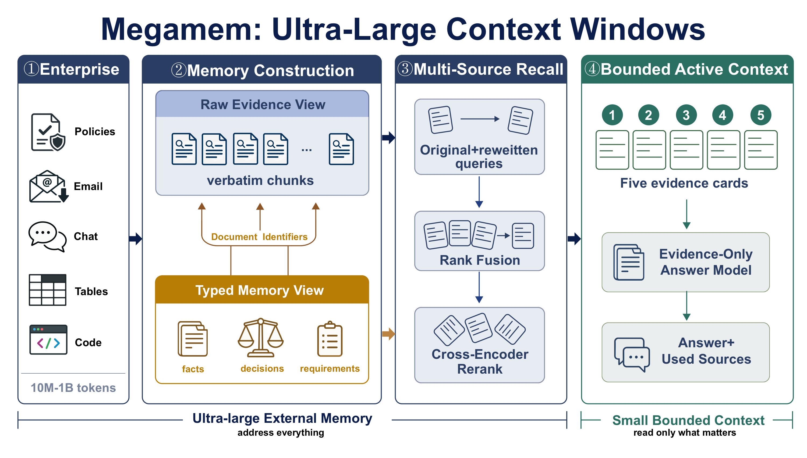
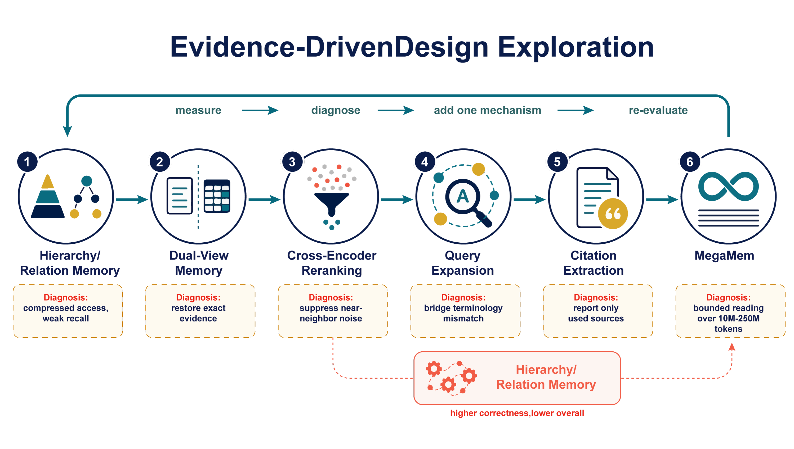
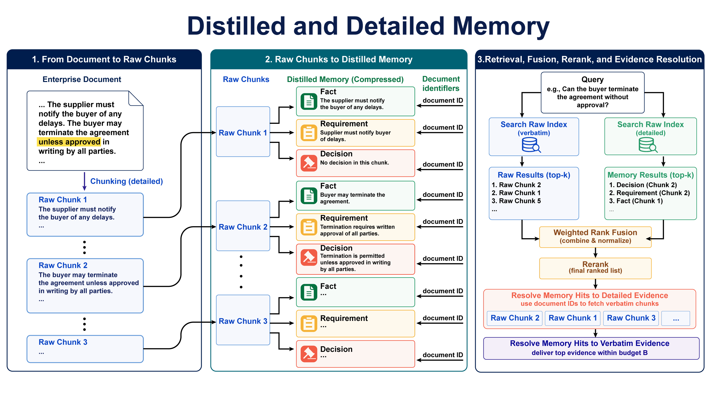
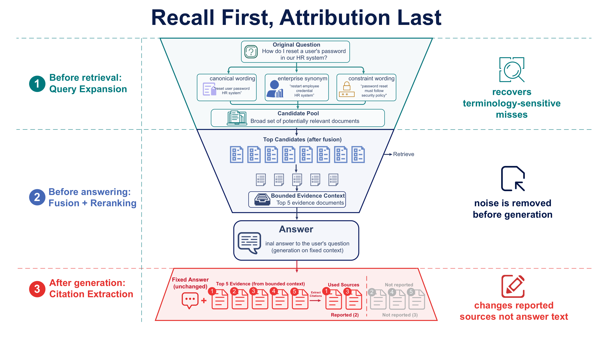

# MegaMem: A Retrieval Solution for Ultra-Large Context Windows

**A retrieval solution for ultra-large context windows**

<p align="center"><strong>Developed by <a href="https://cielara.ai">Cielara AI</a></strong></p>

<p align="center">
  <a href="https://cielara.ai"></a>
  <a href="https://arxiv.org/abs/2608.22137"></a>
  <a href="https://huggingface.co/datasets/xsong69/enterpriseRAG-extension"></a>
  <a href="LICENSE"></a>
  <a href="pyproject.toml"></a>
</p>

Modern models and agents increasingly need persistent memory for complete codebases,
long interaction histories, and heterogeneous enterprise records. Yet only a small
fraction of that memory supports any one answer. Loading more content increases cost and
distractor exposure, while compressed records can omit the dates, exceptions, and
conflicts required for a correct response.

MegaMem separates the full **persistent context** from the bounded **evidence context**
used for one answer. Original and transformed queries search detailed evidence and
distilled typed memories in parallel. Every distilled hit resolves to an immutable
source ID before fusion, deduplication, and reranking; only the highest-ranked detailed
evidence within a fixed budget reaches the answer model.

<p align="center">
  
</p>

<p align="center"><em>The persistent context can grow to approximately 650M tokens while each query loads only a small, source-resolved evidence context for answering.</em></p>

## Evidence-Driven Design Exploration

<p align="center">
  
</p>

<p align="center"><em>MegaMem emerged through a measure-diagnose-revise loop: each mechanism addresses a failure exposed by the preceding design.</em></p>

The initial hierarchy compressed access but weakened recall. A second, detailed view
restored exact evidence; cross-encoder reranking suppressed near-neighbor noise; query
expansion bridged terminology mismatches; and post-answer citation extraction retained
only the sources actually used. Each addition was kept only after re-evaluating the
complete pipeline.

## Distilled and Detailed Memory

<p align="center">
  
</p>

<p align="center"><em>Compact typed memories provide broad retrieval routes, while stable document identifiers resolve every selected memory hit back to detailed source evidence.</em></p>

Documents are divided into detailed chunks and distilled into typed facts,
requirements, and decisions that retain their source identifiers. At query time,
detailed and distilled indexes are searched together, their candidates are fused and
reranked, and selected memory hits are resolved to detailed chunks. Only the
highest-ranked source evidence that fits the answer budget is loaded for generation.

## Multi-Route Recall and Post-Answer Attribution

<p align="center">
  
</p>

<p align="center"><em>Both memory views are searched with original and transformed queries; reciprocal-rank fusion, deduplication, and cross-encoder reranking select detailed evidence, and attribution identifies supporting sources only after the answer is fixed.</em></p>

## Core Guarantees

- **Dual-view memory.** Each `DualNode` pairs a compact retrieval representation with
  detailed source evidence and stable provenance identifiers.
- **Source-resolved generation.** Distilled hits are mapped back to authoritative text
  before reranking, packing, and answer generation.
- **Bounded evidence context.** Candidate depth and answer-context size are independent,
  allowing persistent memory to grow without expanding every prompt.
- **Post-answer attribution.** Reported sources are reduced after generation without
  rewriting the fixed answer.
- **General model gateway.** Every hosted model call resolves through the public
  `general` alias; endpoint, model, and credentials remain deployment configuration.

## Architecture

| Stage | Input | Output | Contract |
| --- | --- | --- | --- |
| Build | Authorized source spans | Distilled and detailed views | Preserve source identifiers |
| Recall | Original and transformed queries | Multi-route candidates | Search both views |
| Resolve | Distilled candidates | Authoritative source text | Never answer from a summary alone |
| Select | Source-text candidates | Ranked evidence set | Fuse, deduplicate, and rerank |
| Pack | Ranked evidence | Bounded evidence context | Enforce an explicit token budget |
| Answer | Packed detailed evidence | Fixed answer | Generate only from source-resolved evidence |
| Attribute | Fixed answer and loaded evidence | Supporting source IDs | Select sources without rewriting the answer |

The key distinction is between **persistent context** and **evidence context**. The
former can contain approximately 650M tokens and grow toward one billion; the latter
remains a small, inspectable evidence budget for one query.

## Installation

MegaMem requires Python 3.11 or newer.

```bash
git clone https://github.com/xfab-xinyuansong/MegaMem.git
cd MegaMem

python -m venv .venv
source .venv/bin/activate
python -m pip install --upgrade pip
pip install -e .
```

The core installation provides the dual-view data contracts, token ledger, CLI, memory
service client, and general model-gateway client without loading a vector database or
local model runtime. Add only the capability groups needed for a deployment:

```bash
pip install -e ".[retrieval,llm,documents]"  # complete local memory pipeline
pip install -e ".[local-models]"             # optional local model execution
pip install -e ".[evaluation]"               # evaluation metrics
pip install -e ".[huggingface]"              # Hugging Face dataset streaming
pip install -e ".[dev]"                      # tests and package build tools
```

## Quick Start

The zero-credential example validates the representation and provenance contracts:

```bash
python examples/minimal_contract.py
```

The same primitives are available from the package root:

```python
from megamem import DualNode, TokenLedger, validate_batch

node = DualNode(
    node_id="policy:001",
    level="L0",
    distilled_text="Travel reimbursement policy and approval rules.",
    detailed_text="Employees must submit receipts within 30 days of travel.",
    distilled_tokens=7,
    detailed_tokens=10,
    source_evidence_ids=["policy:001#section-4"],
)

report = validate_batch([node])
assert report["overall_pass"]

ledger = TokenLedger(run_id="demo", method="dual-view")
ledger.record("retrieval", "local", input_tokens=7, output_tokens=0, wall_seconds=0.01)
print(ledger.grand_total())
```

## Hugging Face Dataset

MegaMem can stream the public
[EnterpriseRAG extension](https://huggingface.co/datasets/xsong69/enterpriseRAG-extension)
without materializing the full corpus locally. The dataset exposes separate
`documents` and `questions` configurations in the schema expected by the benchmark.

```bash
pip install -e ".[huggingface]"
```

```python
from megamem import load_enterprise_rag_documents, load_enterprise_rag_questions

documents = load_enterprise_rag_documents()  # streaming=True by default
questions = load_enterprise_rag_questions()

first_document = next(iter(documents))
first_question = next(iter(questions))
```

Set `streaming=False` when a local Arrow dataset is preferable. Both loaders also
accept `revision` for reproducible snapshot pinning and `token` for authenticated
Hugging Face access.

## API

```dotenv
API=xxx
```

## Package Verification

Credential-free checks cover package imports, CLI behavior, dual-view invariants,
provenance, configuration isolation, and token accounting:

```bash
make check
```

| Package check | Entry point |
| --- | --- |
| Package and CLI | `pytest` |
| Representation and provenance | `python -m megamem.methods.dual_node` |
| Token accounting | `python -m megamem.methods.token_ledger` |

## Repository Layout

```text
MegaMem/
├── src/megamem/
│   ├── methods/          # dual nodes, indexing, hierarchy construction, token ledger
│   ├── document_eval/    # ingestion, retrieval, answering, and metrics
│   ├── retriever/        # semantic, hybrid, planning, and reformulation strategies
│   ├── builder/          # document, chat, and email memory builders
│   ├── processors/       # text, PDF, Word, PowerPoint, Excel, and Markdown readers
│   ├── core/             # memory entries, stores, filters, planners, and source cues
│   └── db_clients/       # vector-store and cache adapters
├── configs/              # public model-routing templates
├── examples/             # runnable, credential-free examples
├── tests/                # package and method checks
```

## Package Scope

This repository contains the installable implementation and public package contracts. It does not ship
private or licensed corpora, generated vector indexes, raw model outputs, real
credentials, provider account configuration, manuscript sources, plotting utilities, or
benchmark result artifacts.

- [Contribution guide](CONTRIBUTING.md)
- [Security policy](SECURITY.md)

## Citation

[Paper](https://arxiv.org/abs/2608.22137) · [PDF](https://arxiv.org/pdf/2608.22137)

```bibtex
@misc{song2026megamem,
  title         = {{MegaMem}: A Retrieval Solution for Ultra-Large Context Windows},
  author        = {Xinyuan Song and Bowen Zhu and Hasibul Haque and Liang Zhao},
  year          = {2026},
  eprint        = {2608.22137},
  archivePrefix = {arXiv},
  primaryClass  = {cs.AI},
  doi           = {10.48550/arXiv.2608.22137},
  url           = {https://arxiv.org/abs/2608.22137}
}
```

## License

MegaMem is released under the [MIT License](LICENSE).
